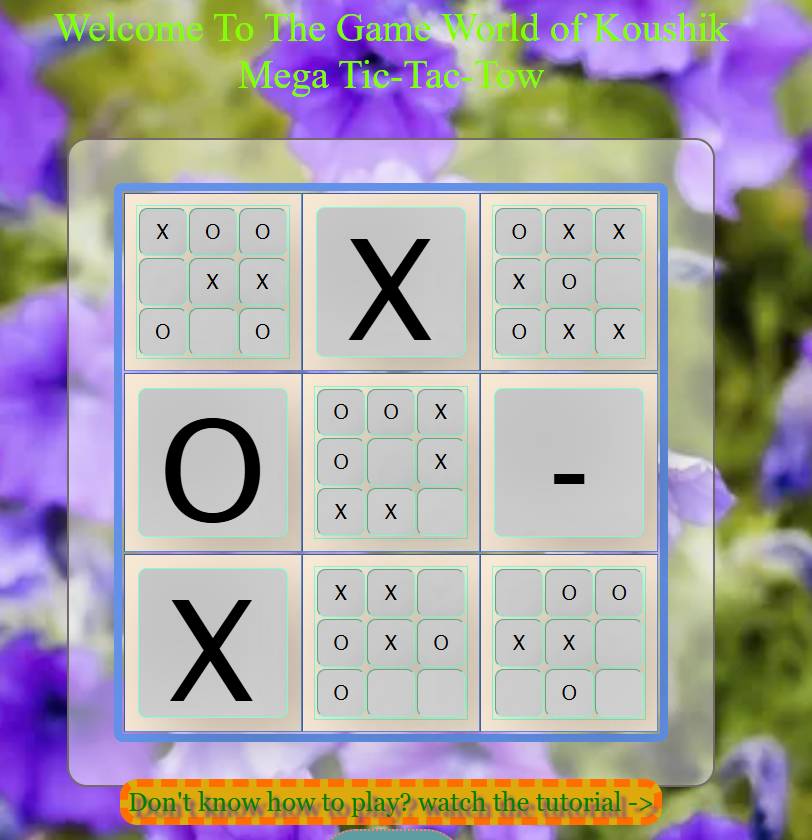

# 🎮 Ultimate Tic Tac Toe

Ultimate Tic Tac Toe is a fun twist on the classic Tic Tac Toe game.  
Instead of playing on one board, you play on **9 smaller boards** arranged in a 3x3 grid — where each move dictates where the opponent plays next.  

This project is built using **HTML, CSS, and JavaScript**.

---

## 🚀 Features
- Classic **Ultimate Tic Tac Toe rules**
- Interactive, responsive UI
- JavaScript-powered game logic
- Highlights active boards
- Player turn tracking & win detection

---

## 📷 Preview

---

## 📂 Project Structure
│── index.html
│── style.css
│── javaScript.js
│── SS.png  
|── Recording.gif
│── README.md
